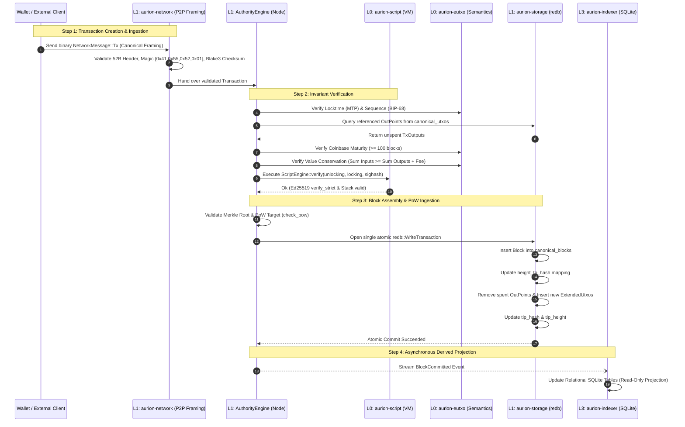

# Aurion Sovereign Protocol: System Architecture & Conceptual Blueprint

## 1. Executive Protocol Philosophy: Sovereign Determinism

The **Aurion Sovereign Digital Asset Protocol** is engineered around a singular foundational axiom:
> **A sovereign digital ledger must be mathematically deterministic, free from ambient environment coercion, memory-safe without exception, and strictly intolerant of state corruption.**

Unlike conventional blockchain systems that mix database drivers, network I/O, and consensus logic into intertwined execution paths, Aurion enforces a **rigorous four-layer constitutional hierarchy (L0 to L3)**. 

Every domain is strictly isolated: pure mathematical ledger rules are decoupled from persistent storage engines, storage custody is strictly concentrated in a single authoritative runtime, and external clients access the ledger solely as untrusted consumers over IPC/RPC.

```text
┌────────────────────────────────────────────────────────────────────────────────────────┐
│                                AURION PROTOCOL TOPOLOGY                                │
└────────────────────────────────────────────────────────────────────────────────────────┘

    [ Untrusted P2P Network ]                 [ External Wallets & Miners ]
               │                                            │
               ▼                                            ▼
 ┌───────────────────────────┐                ┌───────────────────────────┐
 │   L1: aurion-network      │                │       L2: aurion-rpc      │
 │  (Binary Wire Framing)    │                │    (IPC / RPC Schemas)    │
 └─────────────┬─────────────┘                └─────────────┬─────────────┘
               │                                            │
               ▼                                            ▼
 ┌────────────────────────────────────────────────────────────────────────┐
 │                      L1: aurion-node (Runtime)                         │
 │                                                                        │
 │   ┌───────────────────────────┐            ┌───────────────────────┐   │
 │   │      AuthorityEngine      │───────────▶│   NodeState Machine   │   │
 │   │   (Invariant Tripwires)   │            │ (Running | Failed)    │   │
 │   └─────────────┬─────────────┘            └───────────────────────┘   │
 │                 │                                                      │
 │                 ▼                                                      │
 │   ┌───────────────────────────┐                                        │
 │   │   L1: aurion-storage      │ (Exclusive redb Write Custody)         │
 │   │  (Single-Commit Atomic)   │                                        │
 │   └─────────────┬─────────────┘                                        │
 └─────────────────┼──────────────────────────────────────────────────────┘
                   │
         Enforces State Boundary
                   │
                   ▼
 ┌────────────────────────────────────────────────────────────────────────┐
 │                   L0: Stateless Mathematical Core                      │
 │                                                                        │
 │   ┌─────────────────────────┐          ┌───────────────────────────┐   │
 │   │   aurion-primitives     │          │        aurion-core        │   │
 │   │  - Hash256 (Blake3)     │          │  - Block & BlockHeader    │   │
 │   │  - Quantum(u128)        │          │  - Transaction & OutPoint │   │
 │   │  - CanonicalCodec       │          │  - Merkle Root & Sighash  │   │
 │   └─────────────────────────┘          └───────────────────────────┘   │
 │   ┌─────────────────────────┐          ┌───────────────────────────┐   │
 │   │    aurion-consensus     │          │       aurion-script       │   │
 │   │  - PoW check_pow        │          │  - Stack VM (1024 depth)  │   │
 │   │  - 66M Hard Cap Halving │          │  - Ed25519 verify_strict  │   │
 │   │  - Block Verification   │          │  - Turing-Incomplete Ops  │   │
 │   └─────────────────────────┘          └───────────────────────────┘   │
 │   ┌────────────────────────────────────────────────────────────────┐   │
 │   │                         aurion-eutxo                           │   │
 │   │  - Coinbase Maturity (100 blocks)                              │   │
 │   │  - Median Time Past (MTP) & BIP-68 Relative Sequence Locks     │   │
 │   │  - Transaction Fee Verification                                │   │
 │   └────────────────────────────────────────────────────────────────┘   │
 └────────────────────────────────────────────────────────────────────────┘
                   │
      Asynchronous Event Streaming
                   │
                   ▼
 ┌────────────────────────────────────────────────────────────────────────┐
 │                   L3: Observers & Read Projections                     │
 │                                                                        │
 │   ┌────────────────────────────────────────────────────────────────┐   │
 │   │                      aurion-indexer                            │   │
 │   │  - Passive SQLite relational projections                       │   │
 │   │  - Historical queries, block explorers, analytics              │   │
 │   │  - Failure or corruption NEVER cascades to L1 consensus        │   │
 │   └────────────────────────────────────────────────────────────────┘   │
 └────────────────────────────────────────────────────────────────────────┘
```

---

## 2. The Four Constitutional Layers

### Layer 0: Pure Stateless Consensus Core
- **Crates:** `aurion-primitives`, `aurion-core`, `aurion-consensus`, `aurion-script`, `aurion-eutxo`.
- **Invariants:**
  - **Zero-I/O & Zero-Time:** Absolutely no disk access, network sockets, random number generators, or system clock calls (`SystemTime::now()`) are permitted. Time is solely evaluated via ledger parameters (Median Time Past of preceding block headers).
  - **Zero-Float Consensus Accounting:** Strict ban on floating-point arithmetic (`#![deny(clippy::float_arithmetic)]`). The fundamental currency unit is the `Quantum` ($10^{-8}\text{ AUR}$ represented as an integer `u128`).
  - **Pure Determinism:** Given identical inputs, every function must return the exact same output across all architectures (x86_64, aarch64, riscv64).

### Layer 1: Sovereign Runtime & Authority
- **Crates:** `aurion-storage`, `aurion-network`, `aurion-node`.
- **Invariants:**
  - **Exclusive Database Custody:** Physical database files (`aurion.redb`) are owned and opened exclusively by `crates/aurion-storage`. Direct file access by external processes or other crates is strictly prohibited.
  - **Single-Commit Atomicity:** Ingesting a block executes inside a single `redb::WriteTransaction`. The block insertion, height index update, UTXO consumption, new UTXO creation, and tip metadata advance occur atomically or not at all.
  - **Fail-Stop Tripwire:** Any internal state corruption, disk commit error, or invariant breach triggers immediate terminal transition to `NodeState::Failed(NodeFault)`. The node locks down permanently to protect ledger integrity.

### Layer 2: Interface Protocols & Client Tools
- **Crates:** `aurion-rpc`, `bin/aurion` (`wallet`, `mine`).
- **Invariants:**
  - **Strict Storage Isolation:** Client tools must never import `aurion-storage` or open database handles.
  - **Thin-Client Architecture:** All wallet mutations, balance lookups, and mining template requests are submitted via authenticated IPC / JSON-RPC to the running L1 node daemon.

### Layer 3: Derived Observers & Projections
- **Crates:** `aurion-indexer`, `bin/aurion` (`indexer`).
- **Invariants:**
  - **Downstream Consumer Isolation:** Indexes relational projections into SQLite for complex querying, explorer APIs, and analytics.
  - **Zero-Blast Radius:** A complete failure, database crash, or schema corruption in L3 has zero effect on the L1 consensus daemon.

---

## 3. End-to-End Canonical Transaction & Block Lifecycle



---

## 4. Cryptographic Foundations & Determinism

1. **Hashing Engine (Blake3):**
   - Employed exclusively across the protocol for block hashing, transaction IDs, Merkle trees, and P2P packet checksums.
   - Provides tree-hashing parallelism, 256-bit cryptographic collision resistance, and performance significantly exceeding legacy SHA-256 without sacrificing security.

2. **Digital Signatures (Ed25519 `verify_strict`):**
   - High-speed, deterministic signature scheme over Curve25519.
   - Enforces `ed25519_dalek::verify_strict` to prevent signature malleability, reject small-order public keys, and ensure non-malleable transaction authorization.

3. **Malleability-Free SIGHASH:**
   - Preimage hashing for digital signatures zeroes out all `unlocking_script`s before taking the Blake3 digest of the canonical transaction serialization.
   - Eliminates circular signature dependencies and guarantees that transaction IDs remain immutable once authorized.

---

## 5. Defensive Engineering & Fail-Stop Philosophy

Traditional software patterns encourage "fault-tolerant recovery" (e.g., auto-healing, defaulting corrupted values, skipping malformed records). In the domain of sovereign financial consensus, **silent recovery is the primary cause of chain splits, state corruption, and catastrophic currency inflation**.

Aurion adheres to the **Industrial Fail-Stop Mandate**:
1. **Zero Unsafe Code:** `#![forbid(unsafe_code)]` guarantees that buffer overflows, use-after-free, and data races are impossible.
2. **Zero Float Arithmetic:** IEEE-754 nondeterminism across CPU microarchitectures is prevented at compile-time.
3. **No Coercion or Defaults:** Missing database records or corrupt ledger bytes do not fallback to zero; they immediately trip an invariant alarm.
4. **Permanent Terminal Locking:** Once tripped into `NodeState::Failed(NodeFault)`, all mutation APIs are locked down permanently. The physical database is preserved in its last known valid state for forensic analysis.
