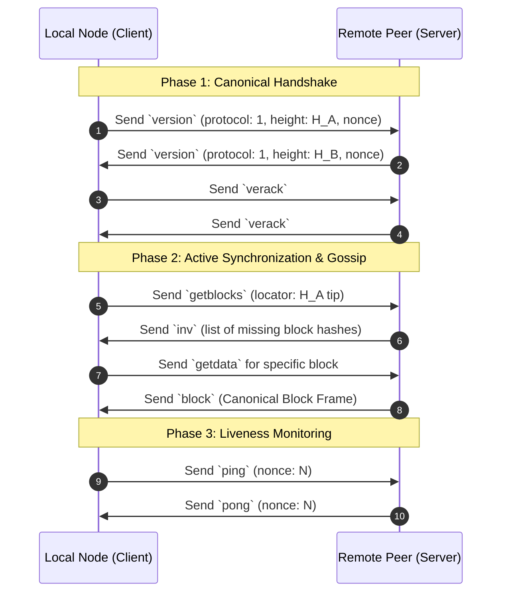

# SPEC-06: P2P Wire Protocol & Network Boundary Specification

## 1. Untrusted Network Boundary Principles

The peer-to-peer (P2P) network is treated as an **untrusted, hostile boundary**. Every inbound byte sequence is subjected to strict verification before any state allocation, deserialization, or execution occurs.

The P2P network framing layer (`crates/aurion-network`) enforces:
1. **Zero-Allocation Rejection:** Packets exceeding the maximum size ceiling ($4\text{ MB}$) are rejected immediately upon reading the header without allocating memory for the payload.
2. **Pre-Allocation Checksum Integrity:** Payloads are hashed using Blake3 and compared against the 32-byte header checksum before being forwarded to the canonical decoder.
3. **Class 1 Fault Isolation:** Network framing violations, malformed packets, and invalid checksums are classified as **Class 1 Operational Faults**. They trigger immediate peer disconnection and ban without affecting the running L1 node consensus state.

---

## 2. Canonical Wire Framing Structure

Every packet transmitted over the wire consists of a fixed **52-byte header** followed by a variable-length payload:

```text
 0                   1                   2                   3
 0 1 2 3 4 5 6 7 8 9 0 1 2 3 4 5 6 7 8 9 0 1 2 3 4 5 6 7 8 9 0 1
+-+-+-+-+-+-+-+-+-+-+-+-+-+-+-+-+-+-+-+-+-+-+-+-+-+-+-+-+-+-+-+-+
|                       Magic (4 bytes)                         |
|                 0x41, 0x55, 0x52, 0x01 ("AUR\x01")            |
+-+-+-+-+-+-+-+-+-+-+-+-+-+-+-+-+-+-+-+-+-+-+-+-+-+-+-+-+-+-+-+-+
|                                                               |
|                     Command Name (12 bytes)                   |
|                   ASCII Null-Padded (e.g. "version\0...")     |
|                                                               |
+-+-+-+-+-+-+-+-+-+-+-+-+-+-+-+-+-+-+-+-+-+-+-+-+-+-+-+-+-+-+-+-+
|                   Payload Length (4 bytes, BE)                |
+-+-+-+-+-+-+-+-+-+-+-+-+-+-+-+-+-+-+-+-+-+-+-+-+-+-+-+-+-+-+-+-+
|                                                               |
|                                                               |
|                   Blake3 Checksum (32 bytes)                  |
|                                                               |
|                                                               |
+-+-+-+-+-+-+-+-+-+-+-+-+-+-+-+-+-+-+-+-+-+-+-+-+-+-+-+-+-+-+-+-+
|                                                               |
|                       Payload (Variable)                      |
|                   [0 .. Payload Length bytes]                 |
|                                                               |
+-+-+-+-+-+-+-+-+-+-+-+-+-+-+-+-+-+-+-+-+-+-+-+-+-+-+-+-+-+-+-+-+
```

### Header Fields

| Field Name | Type | Size (Bytes) | Constraints & Description |
| :--- | :--- | :--- | :--- |
| `magic` | `[u8; 4]` | 4 | Canonical network identifier: `[0x41, 0x55, 0x52, 0x01]` (`AUR` v1). Packets with mismatching magic bytes are dropped immediately. |
| `command` | `[u8; 12]`| 12 | UTF-8/ASCII command identifier, null-padded (`0x00`) to 12 bytes. Unrecognized commands are rejected. |
| `payload_len` | `u32` | 4 | Big-endian length of the following payload. Must satisfy: $\text{payload\_len} \le 4{,}194{,}304\text{ bytes}$ ($4\text{ MB}$). |
| `checksum` | `[u8; 32]`| 32 | Cryptographic Blake3 hash of the payload bytes: $\text{checksum} = \text{Blake3}(\text{payload})$. |

---

## 3. Network Command Taxonomy

The protocol defines 8 canonical message types in `NetworkMessage`:

| Command String | Payload Structure | Semantics & Purpose |
| :--- | :--- | :--- |
| `ping` | `u64` (Nonce) | Liveness probe sent periodically to evaluate connection health. |
| `pong` | `u64` (Nonce) | Liveness response echoing the matching nonce from `ping`. |
| `version` | `u32` (Version), `u64` (Height), `u64` (Timestamp), `String` (User Agent) | Handshake packet advertising protocol capabilities and canonical chain height. |
| `verack` | Empty (`0` bytes) | Handshake acknowledgment confirming version negotiation. |
| `getblocks` | `Hash256` (Locator Hash) | Request for block inventory beginning after the specified locator hash. |
| `inv` | `Vec<(u8, Hash256)>` | Inventory vector advertising newly available blocks or transactions. |
| `block` | `Block` (Canonical serialization) | Complete serialized block containing header and transaction array. |
| `tx` | `Transaction` (Canonical serialization) | Standalone transaction broadcast across the network mempool. |

---

## 4. Connection Lifecycle & Handshake Flow



---

## 5. Security & Anti-Malleability Invariants

1. **Payload Length Validation Before Buffer Allocation:**
   If `payload_len > MAX_FRAME_PAYLOAD_SIZE (4 * 1024 * 1024)`, the connection is terminated instantly. Memory is never pre-allocated based on unverified header claims.
2. **Blake3 Cryptographic Checksum Matching:**
   If $\text{Blake3}(\text{payload}) \ne \text{header.checksum}$, the packet is discarded with `NetworkError::InvalidChecksum` and the peer's reputation score is degraded.
3. **No Trailing Data Permitted:**
   When deserializing canonical payload entities (e.g. `Block`, `Transaction`), any extra bytes remaining after parsing trigger `CodecError::TrailingBytes`, preventing packet smuggling and payload malleability attacks.
