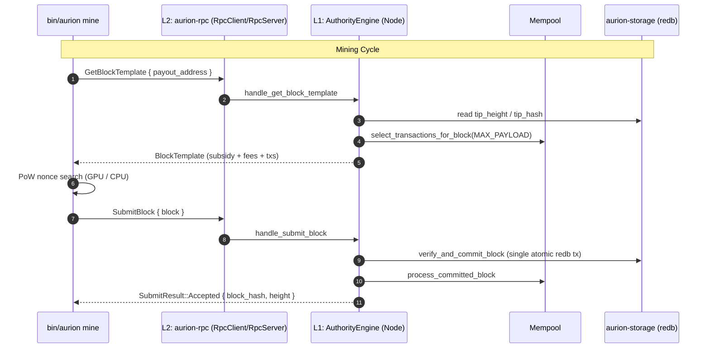

# SPEC-07: IPC/RPC Transport & Mining Bridge Specification

## 1. Local Transport Boundary Principles

The local IPC/RPC boundary (`crates/aurion-rpc`) connects the L1 node daemon (`aurion node`) with the trusted-but-external processes `aurion mine` (miner) and `aurion wallet` (wallet). It is engineered as an asynchronous, **sub-millisecond local transport** operating over TCP loopback / UDS.

The transport adheres to the same constitutional axioms as the rest of the workspace:

1. **Zero-Unsafe:** `#![forbid(unsafe_code)]` is enforced at the crate root; no `unsafe` block may ever be introduced.
2. **Zero-Float:** `#![deny(clippy::float_arithmetic)]`; all monetary values propagate as `Quantum` ($u128$, $10^{-8}\text{ AUR}$).
3. **Deterministic Canonical Encoding:** Every message type implements `CanonicalCodec` whose wire representation is architecture-independent and transitively rejects trailing bytes.
4. **Defensive Allocation Ceiling:** Every wire frame is limited to $4\text{ MB}$. The length prefix is validated **before** any payload buffer is allocated.

```text
┌────────────────────────────────────────────────────────────────────────┐
│                        AURION NODE DAEMON                              │
│                                                                        │
│  ┌──────────────────────┐   Select Txs   ┌──────────────────────────┐  │
│  │      Mempool         │───────────────►│   BlockTemplate Builder  │  │
│  │ (SPEC-05 Validated)  │                │ (Subsidy 99 AUR + Fees)  │  │
│  └──────────────────────┘                └────────────┬─────────────┘  │
│             ▲                                         │                │
│             │ Evict Confirmed                         │ Produces       │
│             │                                         ▼                │
│  ┌──────────┴───────────┐                ┌──────────────────────────┐  │
│  │   AuthorityEngine    │◄───────────────│    RpcServer (IPC/TCP)   │  │
│  │ (redb Atomic Commit) │  SubmitBlock   │   (Local Loopback / UDS) │  │
│  └──────────────────────┘                └────────────▲─────────────┘  │
└───────────────────────────────────────────────────────┼────────────────┘
                                                        │
                                    IPC Transport Wire  │
                             (4B Length-Delimited Frame)│
                                                        │
┌───────────────────────────────────────────────────────┼────────────────┐
│                       BIN/AURION MINE                 │                │
│                                                       ▼                │
│  ┌──────────────────────┐                ┌──────────────────────────┐  │
│  │   Dual-Engine PoW    │◄───────────────│        RpcClient         │  │
│  │ (GPU wgpu / CPU Rayon│ Mined Nonce    │ (Request BlockTemplate & │  │
│  │    Nonce Search)     │                │       Submit Block)      │  │
│  └──────────────────────┘                └──────────────────────────┘  │
└────────────────────────────────────────────────────────────────────────┘
```

---

## 2. Canonical Wire Framing (`frame.rs`)

Every frame over the wire is prefixed with an unsigned 4-byte **Big-Endian** length, followed by the canonical payload. The frame ceiling is $\text{MAX\_RPC\_FRAME\_SIZE} = 4 \times 1024 \times 1024\text{ bytes}$.

```text
 0                   1                   2                   3
 0 1 2 3 4 5 6 7 8 9 0 1 2 3 4 5 6 7 8 9 0 1 2 3 4 5 6 7 8 9 0 1
+-+-+-+-+-+-+-+-+-+-+-+-+-+-+-+-+-+-+-+-+-+-+-+-+-+-+-+-+-+-+-+-+
|                      Payload Length (4 bytes, BE)             |
+---------------------------------------------------------------+
|                                                               |
|                    Payload (0 .. 4,194,304 bytes)            |
|                 (CanonicalCodec serialized message)           |
|                                                               |
+-+-+-+-+-+-+-+-+-+-+-+-+-+-+-+-+-+-+-+-+-+-+-+-+-+-+-+-+-+-+-+-+
```

| Field | Type | Size (Bytes) | Constraints & Description |
| :--- | :--- | :--- | :--- |
| `payload_len` | `u32` (BE) | 4 | Big-endian length of payload. Rejected immediately if $\text{payload\_len} > 4{,}194{,}304$. |
| `payload` | `[u8]` | `payload_len` | Canonical serialization of a request or response. |

**Framing invariants:**
1. The 4-byte length header is read with `read_exact` before any allocation decision is made.
2. An oversized length is terminated as `RpcError::PayloadTooLarge` — memory for the payload is never reserved.
3. An `UnexpectedEof` while reading the length header terminates the session loop gracefully (client disconnected).

---

## 3. Message Taxonomy (`protocol.rs`)

All requests and responses are `CanonicalCodec` enums introduced by a single nonce tag byte.

### 3.1 RPC Requests

| Tag | Variant | Payload Structure | Purpose |
| :--- | :--- | :--- | :--- |
| `0x00` | `GetBlockTemplate` | `Vec<u8>` (payout address) | Miner requests a fresh block template for the given payout address. |
| `0x01` | `SubmitBlock` | `Block` (canonical serialization) | Miner submits a successfully mined block. |
| `0x02` | `SendRawTransaction` | `Transaction` (canonical serialization) | Wallet broadcasts a new transaction into the mempool. |
| `0x03` | `GetTipStatus` | Empty | Probes chain height, best tip hash, and mempool size. |

### 3.2 RPC Responses

| Tag | Variant | Payload Structure | Purpose |
| :--- | :--- | :--- | :--- |
| `0x00` | `BlockTemplate` | `BlockTemplate` | Fresh mining template returned to the miner. |
| `0x01` | `SubmitBlock` | `SubmitResult` | Acceptance (hash + height) or rejection (reason). |
| `0x02` | `TransactionAccepted` | `Hash256` (txid) | Mempool accepted the broadcast transaction. |
| `0x03` | `TipStatus` | `u64` (height), `Hash256` (tip), `u64` (mempool size) | Current chain tip snapshot. |
| `0x04` | `Error` | `String` | Handler-level rejection message. |

---

## 4. Domain Data Structures (`template.rs`)

### 4.1 `BlockTemplate`

| Field | Type | Semantics |
| :--- | :--- | :--- |
| `height` | `u64` | Tip height for the template. |
| `previous_block_hash` | `Hash256` | Parent block hash to build upon. |
| `target` | `Hash256` | Full 256-bit PoW target. |
| `timestamp` | `u64` | Slot timestamp. |
| `coinbase_subsidy` | `Quantum` | Halving-adjusted subsidy (200,000-block schedule, base 99 AUR). |
| `total_fee` | `Quantum` | Aggregate mempool fee collected by the block. |
| `transactions` | `Vec<Transaction>` | Mempool selections ordered canonically. |

### 4.2 `SubmitResult`

| Tag | Variant | Payload Structure |
| :--- | :--- | :--- |
| `0x00` | `Accepted` | `Hash256` (block hash), `u64` (height) |
| `0x01` | `Rejected` | `String` (rejection reason) |

---

## 5. Handler Abstraction & Client (`server.rs`, `client.rs`)

The `NodeRpcHandler` trait decouples transport from the L1 consensus core:

| Method | Returns | Delegated to |
| :--- | :--- | :--- |
| `handle_get_block_template` | `BlockTemplate` | Mempool selection + subsidy scheduler |
| `handle_submit_block` | `SubmitResult` | `AuthorityEngine::verify_and_commit_block` (atomic `redb` commit) |
| `handle_send_raw_tx` | `Hash256` | Mempool ingestion / SPEC-05 validation |
| `handle_get_tip_status` | `(u64, Hash256, usize)` | Tip storage metadata |

The `RpcClient` is a thin sessionless client: each `call` opens one connection, writes a single request frame, reads a single response frame, and closes. Miner loop:

1. `client.get_block_template(&payout_addr)`
2. Assemble coinbase transaction from `coinbase_subsidy + total_fee`
3. Compute binary Merkle root from `[coinbase, ..transactions]`
4. Search for a nonce satisfying `target` (`wgpu` GPU / `rayon` CPU)
5. `client.submit_block(block)`



---

## 6. Security & Anti-DoS Invariants

1. **Length Validation Before Allocation:** the 4-byte BE length is verified against the $4\text{ MB}$ ceiling before any payload `Vec` is allocated.
2. **Deterministic Canonical Decoding:** `CanonicalCodec::decode_canonical` rejects trailing unconsumed bytes (`CodecError::TrailingBytes`), preventing payload smuggling and frame malleability.
3. **Unknown Tag Rejection:** unrecognized protocol tag bytes terminate with `CodecError::InvalidData` rather than a default/unreachable branch.
4. **Sessionless Isolation:** one request per connection means a malformed or hostile peer cannot corrupt subsequent requests; server sessions terminate on framing error.
5. **Zero-Float Accounting:** subsidy and fee propagation never touch IEEE-754 types; all values remain `Quantum`.

---

## 7. Module Layout

```text
crates/aurion-rpc/
├── Cargo.toml
└── src/
    ├── lib.rs              # Compiler directives & facade re-exports
    ├── error.rs            # RpcError taxonomy (Framing, Serialization, Transport)
    ├── frame.rs            # 4-byte BE length-delimited codec (max 4 MB anti-DoS)
    ├── protocol.rs         # Enkoding skema pesan RpcRequest & RpcResponse
    ├── server.rs           # RpcServer listener & dispatcher (tokio::net)
    ├── client.rs           # RpcClient untuk mine dan wallet
    └── template.rs         # Struktur data BlockTemplate & SubmitResult
```